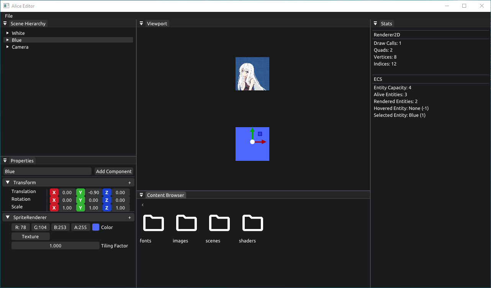

# Alice-00
[](LICENSE)

[[English]](README.md)

使用 C++ 和 OpenGL 实现的 2D 游戏引擎

这是一个学习项目，跟随 TheCherno 的 Game Engine Series 系列视频完成开发

视频地址: [Game Engine Series](https://www.youtube.com/playlist?list=PLlrATfBNZ98dC-V-N3m0Go4deliWHPFwT)

## 特征
- 仅支持 Windows 平台
- 2D 批处理渲染
- 实体组件系统架构
- 包含一个场景编辑器
- ~~待办事项：使用 C# 作为脚本语言~~
- 程序运行性能数据导出

## 安装
### 环境准备
- MinGW-W64 (使用 posix 线程的版本)
- CMake (3.16 及以上版本)

### 下载源代码
```bash
git clone https://github.com/zhtsu/Alice-00.git
cd Alice
git submodule init
git submodule update
```
如果无法成功执行如下的命令
```bash
git submodule update
```
可以根据根目录下 .gitmodules 文件中提供的地址手动下载第三方库到 3rdparty 目录

### 生成可执行文件
双击根目录下 scripts 文件夹中的 Build.bat 脚本即可开始生成

## 屏幕截图

